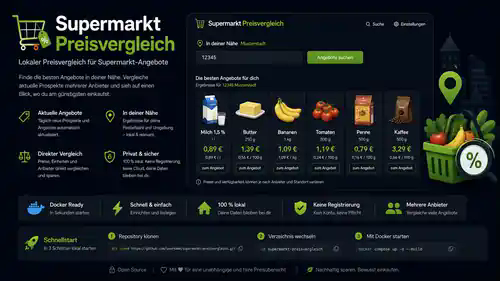

# KorbKlar

[← Sprachauswahl](README.md) · [English](README.en.md)



KorbKlar ist ein selbst gehosteter Vergleich für aktuelle regionale Supermarktangebote in Deutschland. Die Anwendung braucht im normalen Betrieb nur eine deutsche Postleitzahl. Sie ermittelt passende Händler und Märkte, lädt die verfügbaren Wochenangebote, normalisiert Produktnamen, Packungsgrößen und Grundpreise und stellt gleiche oder vergleichbare Angebote gegenüber.

Dabei geht es nicht nur darum, irgendeinen Preis aus einem Prospekt anzuzeigen. KorbKlar versucht die Daten so aufzubereiten, dass beispielsweise unterschiedliche Packungsgrößen, Grundpreise, Bonuspreise und regionale Händlerbestände tatsächlich miteinander vergleichbar werden.

## Warum KorbKlar entstanden ist

KorbKlar ist durch Vibe Coding aus einem sehr konkreten eigenen Anwendungsfall entstanden. Die ursprüngliche Idee war deutlich kleiner: Eine lokale LLM sollte den Preisvergleich automatisch anstoßen und das Ergebnis montags morgens über Conduit ausgeben, damit die neuen Wochenangebote direkt vorliegen.

Während der Entwicklung wurde schnell klar, dass die eigentliche Vergleichslogik besser als eigenständiger Dienst funktioniert. Ohne vorgeschaltete LLM reagiert KorbKlar schneller, lässt sich leichter automatisieren und kann gleichzeitig von Browsern, Skripten, REST-Clients oder später wieder von einer LLM genutzt werden. Für meinen Anwendungsfall ist diese Trennung flexibler als die ursprüngliche reine LLM-Lösung.

Eine LLM ist deshalb heute **keine Voraussetzung**. Wer möchte, kann KorbKlar weiterhin in einen Agenten-, Conduit- oder OpenAPI-Workflow einbauen. Der Preisvergleich selbst bleibt davon unabhängig.

## Schnellstart

Vorausgesetzt werden **Docker Engine**, **Docker Compose v2**, Git und Internetzugriff für den Container.

```bash
git clone https://github.com/lesecuritae/KorbKlar.git
cd KorbKlar
docker compose pull
docker compose up -d --no-build
```

Damit wird das fertig veröffentlichte Image `ghcr.io/lesecuritae/korbklar:latest` aus der GitHub Container Registry verwendet. Für den Standardbetrieb ist keine `.env` erforderlich.

### Lokaler Build aus dem Quellcode

Dieser separate Entwicklerweg baut das Image aus dem ausgecheckten Dockerfile:

```bash
docker compose build
docker compose up -d --no-build
```

Danach im Browser öffnen:

```text
http://SERVER-IP:8000
```

Postleitzahl eingeben, Angebote suchen, fertig. Für den normalen Browserbetrieb müssen weder eine `.env` noch ein API-Schlüssel oder eine LLM eingerichtet werden.

Status prüfen:

```bash
docker compose ps
curl http://127.0.0.1:8000/health
```

Logs:

```bash
docker compose logs -f korbklar
```

Stoppen:

```bash
docker compose down
```

### Anderen Host-Port verwenden

Wenn Port 8000 auf dem Docker-Host bereits belegt ist, kann ein anderer Host-Port gewählt werden. Der Container selbst bleibt auf Port 8000.

```bash
SUPERMARKT_PORT=8080 docker compose up -d --no-build
```

Die Oberfläche ist dann unter `http://SERVER-IP:8080` erreichbar. Dauerhaft kann der Wert auch in einer optionalen `.env` stehen.

Die Laufzeitdaten liegen im Docker-Volume `korbklar-data` und bleiben bei normalen Container-Neustarts erhalten.

## Was bei einer Suche passiert

```text
Postleitzahl
    ↓
regionale Händler und Märkte ermitteln
    ↓
aktuelle Angebote aus den Quellen laden
    ↓
Produkt-, Preis- und Mengenangaben normalisieren
    ↓
Grundpreise und vergleichbare Angebote bestimmen
    ↓
Bonuspreise und konkret bezifferte Vorteile zuordnen
    ↓
Snapshot in SQLite speichern
    ↓
interaktive Ergebnisansicht öffnen
```

Der Browser ist nur die Oberfläche. Händleradapter, Normalisierung, Bonuslogik und Preisvergleich liegen im Python-Core. Die REST-API verwendet denselben Kern und keine zweite Vergleichslogik.

## Unterstützte Händlerquellen

Der aktuelle Stand enthält Adapter beziehungsweise regionale Datenwege für:

- REWE
- EDEKA
- Marktkauf
- ALDI Nord
- ALDI Süd
- Kaufland
- Lidl
- PENNY
- Netto Marken-Discount
- GLOBUS
- Combi
- famila Nordwest

REWE, EDEKA, Marktkauf, Kaufland sowie die passende ALDI-Region werden bevorzugt direkt aus den jeweiligen Händlerquellen geladen. Lidl, PENNY, Netto Marken-Discount, GLOBUS, Combi und famila Nordwest werden über regionale Marktguru-Daten eingebunden. Fällt eine direkte Händlerquelle aus, kann der vorhandene regionale Datenweg gezielt für diesen Händler einspringen. Ein erfolgreicher Direktbestand wird dabei nicht mit einem zweiten vollständigen Bestand vermischt.

Combi und famila Nordwest gehören zur Bünting-Gruppe und sind nur im Nordwesten vertreten. Beide sind deshalb optional wie Marktkauf und GLOBUS: Liefern sie nichts, wird das nicht als Quellenfehler gemeldet.

Ihre regionale Abdeckung im Marktguru-Bestand ist uneinheitlich und für beide Marken nicht deckungsgleich. Eine Postleitzahl im Vertriebsgebiet kann eine Marke, beide oder keine liefern. Eine Filiale in der Nähe garantiert also keine Angebote. KorbKlar zeigt, was der regionale Bestand tatsächlich hergibt, und setzt keine Daten aus einem anderen Gebiet ein.

famila Nordwest und famila Nordost sind getrennte, voneinander unabhängige Handelsgruppen. Erkannt wird nur famila Nordwest; famila Nordost ist ausdrücklich ausgeschlossen und kann nie unter der Bünting-Marke erscheinen.

Welche Händler tatsächlich erscheinen, hängt von Postleitzahl, Region und den aktuell erreichbaren Quelldaten ab. Händler ohne Treffer werden nicht als leere Filter angezeigt.

Für einen Quellencheck aus dem laufenden Container gibt es die Runtime-Diagnose:

```bash
docker exec korbklar python -m supermarkt.diagnostics 12345
```

## Ergebnisansicht

Die Ergebnisansicht bietet unter anderem:

- Händlerfilter
- Suche nach Produkt oder Marke
- Sortierung nach Preis, Grundpreis, Händler oder Produkt
- Ansicht nur der günstigsten sicheren Vergleichstreffer oder aller Angebote
- Produktbilder über einen lokalen Bildproxy
- getrennte Anzeige von Packungsgröße und Grundpreis
- normale Preise und Preise mit ausgewählten Bonusprogrammen
- Mehrfachauswahl der Bonusprogramme
- Hinweise zu ausgefallenen oder unvollständigen Quellen
- eine Zeile für ein identisches Angebot, das mehrere Händler zum selben Preis führen
- automatisches Nachladen beim Scrollen
- Angebote einzeln oder als Auswahl auf eine KitchenOwl-Einkaufsliste setzen

Packungsgröße und Referenzmenge des Grundpreises werden getrennt behandelt. Aus einer 0,33-l-Dose mit einem Grundpreis pro Liter wird deshalb beispielsweise `330 ml` als Packungsgröße und der Literpreis separat dargestellt. Alternative Größen wie `85 g oder 100 g` werden nicht zu `185 g` addiert.

Quellen-Platzhalter wie `This is no brand` werden als fehlende Marke behandelt und nicht vor den Produktnamen gesetzt. Bei Auswahl genau eines Händlers blendet die Oberfläche die dann redundante Händlerspalte aus.

## Gleiche Angebote bei mehreren Händlern

Handelsgruppen fahren eine Aktion über mehrere Marken, deshalb bewerben famila Nordwest und Combi in derselben Woche dasselbe Produkt zum selben Preis. Auch voneinander unabhängige Händler übernehmen gelegentlich dieselbe Herstelleraktion. Solche Zeilen sagen dasselbe.

Sind Angebote bereits als vergleichbar erkannt und stimmt der Preis auf einen halben Cent überein, erscheinen sie als **eine** Zeile, die alle Händler nennt. Am Preis ändert sich nichts, Händlerfilter finden die Zeile unter jedem ihrer Händler, und die Händler-Chips zählen sie für jeden mit.

Angebote, die nie einander zugeordnet wurden, bleiben getrennt, selbst wenn der Preis zufällig gleich ist. Wenn `Orangen` für `2,49 €` bei einem Händler 1500 g und beim anderen 300 g sind, sind das zwei verschiedene Angebote; sie zusammenzufassen würde das verdecken.

## Bonusprogramme

Mehrere Programme können gleichzeitig aktiviert werden. Der Code kennt unter anderem:

- REWE Bonus
- Lidl Plus
- PENNY App
- Netto plus App
- Kaufland Card XTRA
- EDEKA App
- MARKTKAUF App
- mein GLOBUS
- PAYBACK bei unterstützten Händlern

Verrechnet werden nur Vorteile, für die die Angebotsdaten einen konkreten Produktpreis oder einen konkret bezifferten Euro-Vorteil liefern. Persönliche Coupons, Punktewerte oder nicht bezifferte Aktionen werden nicht in erfundene Euro-Rabatte umgerechnet.

## Kein LLM-Zwang

Der normale Datenweg ist bewusst einfach:

```text
Browser oder REST-Client
        ↓
      KorbKlar
        ↓
  Händlerquellen
```

Eine LLM kann davor oder dahinter eingesetzt werden, etwa für natürlichsprachliche Abfragen, Zusammenfassungen oder einen automatisierten Montagsbericht. Sie ist aber keine Runtime-Abhängigkeit. Dadurch bleibt der eigentliche Vergleich schnell und kann unabhängig von einem bestimmten Modell, Agenten oder Frontend betrieben werden.

## REST-API

Für Automationen und externe Clients gibt es zusätzlich den Vergleichsendpunkt:

```text
POST /api/v1/compare
```

Minimaler Request:

```json
{
  "postal_code": "01067"
}
```

Beispiel mit mehreren Bonusprogrammen:

```json
{
  "postal_code": "01067",
  "loyalty_programs": [
    "rewe_bonus",
    "lidl_plus",
    "kaufland_xtra",
    "payback"
  ],
  "view": "best_only"
}
```

Ist die Einkaufslisten-Anbindung konfiguriert, kommen zwei Endpunkte dazu:

```text
GET  /api/v1/shopping-list/targets
POST /api/v1/shopping-list/items
```

Der Browserbetrieb funktioniert ohne Schlüssel. Soll die REST-Schnittstelle zusätzlich mit Bearer-Authentifizierung geschützt werden, kann `SUPERMARKT_API_KEY` gesetzt werden; der Schlüssel gilt dann für den Vergleichsendpunkt und beide Einkaufslisten-Endpunkte. Die weiteren optionalen Einstellungen stehen in [`.env.example`](.env.example).

## Einkaufsliste über KitchenOwl

KorbKlar schreibt Angebote auf eine Einkaufsliste in [KitchenOwl](https://kitchenowl.org), einer selbst gehosteten Einkaufsliste mit gemeinsamen Haushalten.

Ist im Haushalt bereits ein passender Artikel angelegt, landet das Angebot dort statt als beinahe gleicher Zweitartikel: „GUT&GÜNSTIG Weizenbrötchen / Schrippen" wird zu deinem vorhandenen „Brötchen", der vollständige Angebotsname rückt in die Notiz. Verglichen wird über ganze Wörter, wobei das Grundwort deutscher Komposita hinten steht — „Weizenbrötchen" trifft „Brötchen", „Buttermilch" dagegen „Milch" und nicht „Butter". Abschaltbar über `SUPERMARKT_KITCHENOWL_MATCH_ITEMS=0`.

Der Händler wird zur Kategorie, damit die Liste nach Markt gruppiert; fehlende Kategorien legt KorbKlar an. KitchenOwl-Kategorien haben nur einen Namen und kein Bildfeld, ein Ladenlogo ist also nicht möglich — `SUPERMARKT_KITCHENOWL_CATEGORY_PREFIX` stellt stattdessen ein Emoji davor, standardmäßig `🛒`.

**Zu bedenken:** Die Kategorie hängt am Artikel, nicht am Listeneintrag. Ein Artikel wandert also mit, sobald ein anderer Markt ihn günstiger anbietet. Wer lieber nach Abteilungen sortiert, setzt `SUPERMARKT_KITCHENOWL_RETAILER_CATEGORIES=0`; dann bleibt der Händler in der Notiz.

In die Notiz kommt nur, was das Angebot wirklich hergibt: Menge, Preis, Packungsgröße und Gültigkeit. Der Angebotsname steht dort nur, wenn der Artikel anders heißt — sonst stünde er doppelt. Nichts wird geschätzt.

### KitchenOwl im Stack

Das Profil `proxy` startet KitchenOwl gleich mit, auf einer eigenen Subdomain:

```bash
KORBKLAR_KITCHENOWL_DOMAIN=einkauf.deine-domain.de
KITCHENOWL_JWT_SECRET=ein-langer-zufaelliger-wert
KITCHENOWL_PUBLIC_URL=https://einkauf.deine-domain.de
docker compose --profile proxy up -d
```

Das Secret erzeugst du auf dem Server mit `openssl rand -base64 48`. Es ist Pflicht: KitchenOwl **lehnt einen fehlenden Wert nicht ab**, sondern nutzt still einen veröffentlichten Standard, und ein leerer Wert ergibt einen leeren Signierschlüssel — damit wären seine Tokens fälschbar. Der Stack prüft das deshalb vor dem Start und bricht mit einer Meldung ab. Einmal gesetzt, sollte der Wert nicht mehr geändert werden; ein neuer entwertet alle Sitzungen und Long-lived Tokens.

Auch für diese Subdomain muss ein DNS-Record auf den Server zeigen, sonst bekommt Caddy kein Zertifikat.

Beim ersten Aufruf legst du in KitchenOwl Konto und Haushalt an.

### Verbindung herstellen

Den Token erzeugst du in KitchenOwl unter Profil, Sitzungen, Long-lived Tokens. Danach in `.env`:

```bash
SUPERMARKT_KITCHENOWL_URL=http://kitchenowl-web
SUPERMARKT_KITCHENOWL_TOKEN=dein-long-lived-token
```

Im mitgelieferten Stack spricht KorbKlar den Web-Container im Compose-Netz an, nicht das Backend: dieses lauscht auf einem uwsgi-Socket und nicht auf HTTP. Die Anfragen verlassen den Server dabei nicht. Läuft KitchenOwl woanders, trägst du dort die Adresse seiner Weboberfläche ein.

`SUPERMARKT_KITCHENOWL_LIST_ID` wählt eine Liste nur vor. KorbKlar liest die Listen aller erreichbaren Haushalte aus KitchenOwl und bietet sie in der Ergebnisliste zur Auswahl an. Nicht vorhandene Listen werden abgelehnt, bevor etwas geschrieben wird. Der Token bleibt auf dem Server und erscheint auch in `/health` nicht.

In der Ergebnisliste hat jedes Angebot einen Knopf **→ KitchenOwl**. Ein Klick legt es in der Liste ab, die du oben in der Leiste einmal auswählst; der Knopf bestätigt mit `✓ in <Liste>`. Ein Zwischenschritt ist nicht nötig.

Daneben gibt es weiterhin den Tab **Einkauf**. Diese Liste heißt dort „Eigene Liste" und bleibt im Browserprofil — sie kann Mengen, Pfand und Summen je Händler, was KitchenOwl nicht kennt. Rechts daneben steht der abgesetzte Bereich **KitchenOwl** mit Ziel-Liste und dem Knopf „Kopie senden". Gesendet wird eine Kopie: die eigene Liste bleibt unverändert, abgehakte Artikel werden übersprungen, und die Rückmeldung nennt Anzahl, Ziel-Liste und übersprungene Artikel.

Die Menge führt die Notiz an, weil KitchenOwl kein eigenes Mengenfeld hat.

Bleiben `SUPERMARKT_KITCHENOWL_URL` oder `SUPERMARKT_KITCHENOWL_TOKEN` leer, ist die Anbindung abgeschaltet und die Oberfläche blendet die Bedienung aus.
## Öffentlich betreiben: API-Key und VPN

Ohne `SUPERMARKT_API_KEY` ist nichts eingeschränkt; eine private Instanz verhält sich wie bisher.

Ist der Schlüssel gesetzt, braucht **jede** Route außer `/health` entweder diesen Bearer-Token oder eine Quell-IP aus `SUPERMARKT_TRUSTED_NETWORKS`:

```bash
SUPERMARKT_API_KEY=ein-langer-zufaelliger-schluessel
SUPERMARKT_TRUSTED_NETWORKS=10.8.0.0/24
SUPERMARKT_TRUSTED_PROXIES=127.0.0.1/32
```

Damit deckt eine Instanz beide Fälle ab: Im VPN ist die Oberfläche ohne Login erreichbar, App und Skripte weisen sich von überall mit dem Token aus, alle anderen bekommen 401. Die Prüfung sitzt als Middleware vor sämtlichen Routen, damit eine neu hinzugefügte Route nicht versehentlich offen bleibt.

`/health` bleibt für Container-Healthchecks erreichbar, verrät ohne Autorisierung aber nur `status` und `service`. Cache-Pfade, Quellenzuordnung und Einkaufslisten-Details erscheinen erst für autorisierte Aufrufer.

### Hinter einem Reverse Proxy

`X-Forwarded-For` wird ausschließlich geglaubt, wenn der direkte Peer in `SUPERMARKT_TRUSTED_PROXIES` steht. Die Kette wird von rechts gelesen und bekannte Proxys werden übersprungen, damit ein Client sich nicht durch einen vorangestellten Eintrag eine erlaubte Adresse geben kann. Ohne konfigurierte Proxys wird der Header vollständig ignoriert.

**uvicorn muss dabei mit `--no-proxy-headers` laufen.** Standardmäßig wertet uvicorn `X-Forwarded-For` selbst aus und ersetzt die Client-Adresse, bevor KorbKlar sie sieht — wer den Header setzen kann, umgeht damit `SUPERMARKT_TRUSTED_NETWORKS`. Das mitgelieferte Docker-Image startet bereits korrekt; bei eigenem Start das Flag nicht vergessen.

Der Reverse Proxy sollte ein vom Client mitgeschicktes `X-Forwarded-For` zusätzlich verwerfen oder überschreiben.

## HTTPS und Deployment

Der Compose-Stack bringt einen optionalen Reverse Proxy mit. Caddy holt und erneuert die Let's-Encrypt-Zertifikate selbst, ohne certbot-Container und ohne Cron.

```bash
KORBKLAR_DOMAIN=korbklar.deine-domain.de
KORBKLAR_ACME_EMAIL=du@deine-domain.de
docker compose --profile proxy up -d
```

Ohne `--profile proxy` startet der Stack unverändert wie bisher; der Proxy-Container wird dann gar nicht angelegt.

Vor dem ersten Start muss ein A- beziehungsweise AAAA-Record der Domain auf den Server zeigen und Port 80 und 443 erreichbar sein — Let's Encrypt prüft darüber.

### Aufteilung zwischen VPN und Internet

Die Netz-Allowlist prüft die Quell-IP, **wie der Server sie sieht**. Wer über das Internet auf die öffentliche Domain zugeht, erscheint mit der IP seines Providers, nicht mit der VPN-Adresse. Deshalb sind es zwei getrennte Wege:

| Weg | Adresse | Autorisierung |
| --- | --- | --- |
| Oberfläche im VPN | `http://VPN-IP:8000` | Quell-IP aus `SUPERMARKT_TRUSTED_NETWORKS`, kein Login |
| App und Skripte | `https://korbklar.deine-domain.de` | Bearer-Token |

`KORBKLAR_BIND_ADDRESS` legt fest, auf welcher Schnittstelle Port 8000 veröffentlicht wird. Hinter dem Proxy gehört dort die VPN-Adresse hin, damit die Oberfläche nicht zusätzlich öffentlich hängt:

```bash
KORBKLAR_BIND_ADDRESS=10.8.0.1
```

`SUPERMARKT_TRUSTED_PROXIES` muss das Compose-Netz enthalten, in dem Caddy läuft, sonst wird sein `X-Forwarded-For` ignoriert. Beide Werte stehen standardmäßig auf `172.28.0.0/24`.

Caddy **überschreibt** ein vom Client mitgeschicktes `X-Forwarded-For` mit der tatsächlichen Gegenstelle, statt es zu ergänzen. Die Allowlist bekommt so nie eine Adresse zu sehen, die der Client selbst gewählt hat.

### Eigenes Image aus der CI

Der Workflow baut bei jedem Push auf `main` und veröffentlicht nach GHCR im Namensraum des Repository-Eigentümers. In einem Fork ist das automatisch der eigene. Auf dem Server danach nur noch:

```bash
docker compose pull && docker compose up -d --no-build
```

Damit `pull` das eigene Image zieht, in `.env` setzen:

```bash
KORBKLAR_IMAGE=ghcr.io/DEIN-NAME/korbklar:latest
```

In einem frisch geforkten Repository sind GitHub Actions deaktiviert; einmal im Reiter „Actions" freigeben. Das erzeugte Paket ist zunächst privat — entweder unter „Packages" auf öffentlich stellen, oder auf dem Server einmal `docker login ghcr.io` mit einem Token, das `read:packages` erlaubt.

## Cache steuern

KorbKlar hält mehrere Caches mit unterschiedlichen Lebensdauern:

| Was | Schlüssel | Frisch | Danach |
| --- | --- | --- | --- |
| Angebots-Snapshot | PLZ und ALDI-Region | `SUPERMARKT_CACHE_TTL_MINUTES`, Standard 30 Minuten | wird neu geladen |
| Ergebnislink | `search_id` | — | bleibt `SUPERMARKT_RESULT_RETENTION_HOURS` lang öffenbar, auch veraltet |
| REWE- und Kaufland-Filialzuordnung | PLZ | 24 Stunden | wird neu ermittelt |
| Bildcache | Bild-URL | 7 Tage, 512 MiB | wird verworfen |

Innerhalb der Frische liefert jede Suche derselben Postleitzahl denselben Snapshot. Ein Neuabruf lässt sich auf drei Wegen erzwingen:

- der Knopf **Neu laden** auf der Ergebnisseite und in der App
- `"refresh": true` im Rumpf von `POST /api/v1/compare`
- das Kommandozeilenwerkzeug, das auch die übrigen Caches leert

```bash
docker exec korbklar python -m supermarkt.cache_cli status
docker exec korbklar python -m supermarkt.cache_cli purge --postal-code 26188
docker exec korbklar python -m supermarkt.cache_cli purge --all
```

`purge` löscht Snapshots, optional zusätzlich Bildcache (`--images`) und Filialzuordnungen (`--stores`); `--all` umfasst beides. Der Signierschlüssel bleibt unangetastet, damit bereits verschickte Ergebnislinks anderer Suchen gültig bleiben.

## Daten, Cache und Bildproxy

SQLite ist Bestandteil der Python-Standardbibliothek. Ein externer Datenbankserver wird nicht benötigt.

Standardmäßig werden im persistenten Datenpfad gespeichert:

- Angebots-Snapshots
- der automatisch erzeugte Signierschlüssel
- der Bildcache
- Händler- beziehungsweise Filialzuordnungen, soweit ein Adapter sie zwischenspeichert

Der Snapshot-Cache verhindert, dass Filter, Sortierung und nachgeladene Ergebnisblöcke dieselben Händlerquellen ständig neu abrufen. Cache-Frische und Lebensdauer bereits erzeugter Ergebnislinks sind voneinander getrennt.

Der Bildproxy validiert externe Bildziele, blockiert private und Loopback-Adressen und verwirft typische Tracking-, Pixel-, Logo- und Platzhalter-URLs. Bilder werden lokal zwischengespeichert.

## Signierte Ergebnis- und Bildlinks

KorbKlar erzeugt beim ersten Start selbstständig einen zufälligen HMAC-Schlüssel und speichert ihn im persistenten Daten-Volume. Der Nutzer muss diesen Schlüssel im Standardbetrieb nicht selbst anlegen. Ergebnis- und Bildlinks können dadurch signiert werden und bleiben über normale Container-Neustarts hinweg gültig, solange das Volume erhalten bleibt.

## Konfiguration

Für den Standardbetrieb ist keine Konfiguration nötig. Die vollständige Liste der optionalen Variablen steht in [`.env.example`](.env.example). Dazu gehören unter anderem Host-Port, API-Key, Cache-Laufzeiten, Timeouts, Parallelität und Größenbegrenzungen des Bildcaches.

## Python ohne Docker

Docker ist der empfohlene Weg. Für Entwicklung oder eine manuelle Installation kann KorbKlar auch direkt mit Python **3.12 oder neuer** betrieben werden:

```bash
python -m venv .venv
. .venv/bin/activate
pip install -e .
uvicorn supermarkt.asgi:app --host 0.0.0.0 --port 8000
```

## Entwicklung und Tests

```bash
python -m venv .venv
. .venv/bin/activate
pip install -e '.[dev]'
pytest -m 'not live'
```

Live-Tests gegen externe Händlerquellen sind bewusst opt-in:

```bash
RUN_LIVE_TESTS=1 pytest -m live
```

Die Offline-Suite prüft unter anderem PLZ-Validierung, Browser- und API-Routen, Cache-Verhalten, Packungs- und Grundpreisnormalisierung, Bonuskombinationen, Händlerfilter, Bildproxy, SSRF-Schutz und Release-Sauberkeit.

## Architektur

```text
src/supermarkt/
├── sources/             Händleradapter
├── models.py            Datenmodelle und Händlerdefinitionen
├── common.py            Normalisierung und gemeinsame Helfer
├── region.py            regionale Zuordnung
├── compare.py           Mapping, Deduplizierung und Preisvergleich
├── loyalty.py           Bonusprogramme und bezifferbare Vorteile
├── cache.py             SQLite-Snapshot-Cache
├── service.py           Orchestrierung der Quellen
├── presentation.py      Ausgabefelder
├── images.py            Bilddownload, Cache und SSRF-Schutz
├── security.py          Signaturen und optionaler API-Key
├── authz.py             API-Key, vertrauenswürdige Netze, Proxy-Auswertung
├── cache_cli.py         Cache-Status und -Bereinigung
├── kitchenowl.py        Einkaufslisten in KitchenOwl
├── shopping_routes.py   Routen der Einkaufsliste
├── access.py            Zugriffs- und Request-Helfer
├── api_routes.py        REST-Routen
├── browser_routes.py    Browser-Routen
├── media_routes.py      Bild- und Medienrouten
├── health_routes.py     Healthcheck
├── runtime.py           gemeinsame Runtime-Objekte
└── static/              HTML, CSS und JavaScript der Oberfläche
```

Die Händleradapter kennen die jeweiligen Datenquellen. Die Oberfläche berechnet keine Preise. Dadurch können Quellen, Vergleichskern, REST-API und Browseroberfläche unabhängig voneinander geändert und getestet werden.

## Grenzen

Händlerseiten und nicht dokumentierte Webschnittstellen können sich ändern. Ein einzelner Adapter kann deshalb zeitweise ausfallen, obwohl KorbKlar selbst läuft. Wo ein geeigneter regionaler Ersatzdatenweg vorhanden ist, kann dieser händlerspezifisch einspringen. Ansonsten bleibt der Vergleich mit den übrigen erreichbaren Quellen nutzbar.

Der Kaufland-Adapter benötigt einen Chromium-kompatiblen Browser. Das Docker-Image bringt ihn mit; bei lokaler Installation werden die üblichen Namen und Installationspfade von Chromium, Chrome und Edge gesucht, alternativ setzt `SUPERMARKT_CHROMIUM_BINARY` den Pfad. Ohne Browser fällt nur dieser eine Adapter aus und Marktguru springt für ihn ein.

KorbKlar erfindet keine fehlenden Preise und schätzt keine unbekannten Bonusvorteile. Die Ergebnisse sind nur so vollständig und aktuell wie die erreichbaren Quelldaten.

## Lokal entwickeln und debuggen

```bash
python -m venv .venv
. .venv/bin/activate
pip install -e '.[dev]'
pytest -m 'not live'
```

Unter Windows wird statt des Aktivierungsskripts `.venv\Scripts\python.exe` verwendet. Das `dev`-Extra installiert dort zusätzlich `tzdata`, weil Windows keine IANA-Zeitzonendatenbank mitbringt und `Europe/Berlin` sonst schon beim Import fehlschlägt.

Zum Debuggen gegen echte Quellen wird die Anwendung direkt gestartet, mit Laufzeitdaten außerhalb des Benutzerverzeichnisses:

```bash
SUPERMARKT_DATA_DIR=.devdata uvicorn supermarkt.asgi:app --host 127.0.0.1 --port 8000 --reload
```

Der Kaufland-Adapter steuert ein Headless-Chromium, das im Docker-Image enthalten ist. Ohne lokal installiertes Chromium fällt genau dieser Adapter aus und Marktguru springt für ihn ein; alle übrigen Quellen arbeiten unverändert.

Die Live-Diagnose einer Postleitzahl läuft auch ohne Container:

```bash
SUPERMARKT_DATA_DIR=.devdata python -m supermarkt.diagnostics 26123
```

## Roadmap

Die oben beschriebene Anbindung an KitchenOwl ist umgesetzt. Weitere Integrationen sind für spätere Versionen vorgesehen, darunter Grocy und zusätzliche REST-/OpenAPI-Anbindungen für lokale Automationen und Agenten.

## Neuerungen in 0.0.3

Kategorien werden auf 18 feste deutsche Hauptkategorien normalisiert. HOL’AB! erscheint nur für PLZ aus der offiziellen Marktliste; sechs strukturierte Angebote sind ehrlich als Teilabdeckung markiert. Pfand und Mengenbedingungen bleiben getrennt. REWE nutzt vorhandene Karten-Deeplinks, Lidl ohne sichere Kennung eine offizielle Produktsuche. Lightbox, lokales Hintergrundmotiv und automatisches Hell-/Dunkeldesign laden keine Drittanbieter-Assets.

Der Bereich **Einkauf** speichert die persönliche Liste ausschließlich im IndexedDB-Speicher des jeweiligen Browserprofils. Es gibt keine Konten, serverseitigen persönlichen Listen, Tracker oder automatische Gerätesynchronisation. Angebote und manuelle Artikel lassen sich hinzufügen, bearbeiten, abhaken und nach Händler gruppieren. Warenwert und Pfand werden mit Integer-Cent-Beträgen getrennt berechnet; fehlen Preise, heißt die Anzeige ehrlich „Bekannte Gesamtsumme“. Gespeicherte Angebotspreise werden durch spätere Suchen nicht still geändert, Ablauf und Mengenbedingungen bleiben sichtbar.

Für die Geräteübergabe stehen lesbarer Text, Zwischenablage, Web Share, TXT sowie ein versioniertes JSON-Backup mit Importvorschau bereit. Importdaten sind auf 256 KiB begrenzt und werden ausschließlich lokal geparst. Das kanonische Datenmodell trennt Menge, Einheit, Packung, lokale ID, Angebots-ID, Quell-ID und optionalen Barcode. Eine kleine Adaptergrenze bereitet spätere KitchenOwl-/Grocy-Adapter vor; 0.0.3 enthält keine solche Verbindung und keinen Sync.

ALDI wird aus exakten offiziellen PLZ-Nachweisen beziehungsweise belastbaren Filial-Tags bestimmt. Grenzgebiete laden Nord und Süd getrennt. Die Angebotskette verwendet offizielle Seiten, einen schema- und regionsgebundenen Last-known-good-Cache und erst danach austauschbare externe Katalogdaten; niemals ersetzt Nord die Süd-Region oder umgekehrt.
